# 📐 AscendIA — Diagramas de Arquitectura (v2025-11)

Diagramas técnicos oficiales que documentan la arquitectura, flujos, modelo de datos y estructura interna de AscendIA.  
Todos los diagramas están construidos con **Mermaid** y listos para ser renderizados por GitHub.

> Archivo de trabajo (Excalidraw / bocetos): `/mnt/data/InterviewApp_worktable.excalidraw`  
> (el archivo ya fue subido al repositorio de trabajo; se incluye enlace local para referencia y exportaciones visuales).

---

  

## Índice

1. Arquitectura General — Server-First Platform
2. Flujo de Autenticación Clerk ↔ Neon (Sequence)
3. Webhook Clerk — Arquitectura Idempotente y Auditada
4. Modelo de Datos — Drizzle + Neon (ERD, espaciamiento aumentado)
5. Flujo de Creación de Entrevista (Server Action)
6. Flujo del Dashboard — Server Components
7. Arquitectura del Módulo Interviews
8. Flujo Interno de `getInternalUser()`
9. Flujo de Validaciones — Zod Client + Server
10. Integración con Vapi AI (Sesiones / Guardado)
11. Flujo detallado de Server Actions y observabilidad (Sentry / métricas)
12. Migraciones y enums (nota visual)

  
  

# 1. Arquitectura General — Server-First Platform

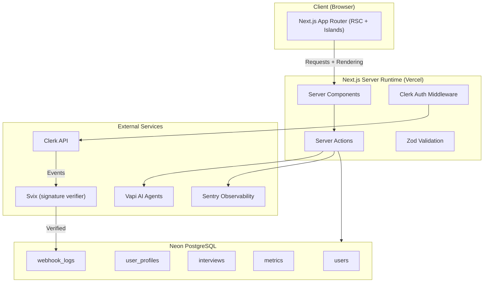

- Mapa de componentes principales: cliente (RSC + islands), server runtime (Server Components / Actions), DB en Neon y servicios externos (Clerk, Svix, Vapi, Sentry).

  
  

# 2. Arquitectura General — Server-First Platform

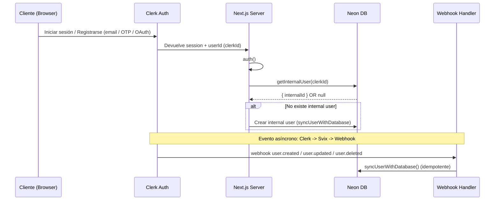

- Muestra tanto el flujo de login inmediato como el evento asíncrono por webhook para mantener la DB sincronizada.

  
  

# 3. Webhook Clerk — Arquitectura Idempotente y Auditada

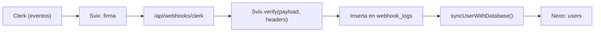

- El webhook verifica firma (Svix), registra el evento, y ejecuta la sincronización idempotente garantizando trazabilidad y reintentos seguros.

  
  

# 4.Modelo de Datos — Drizzle + Neon (Versión oficial)

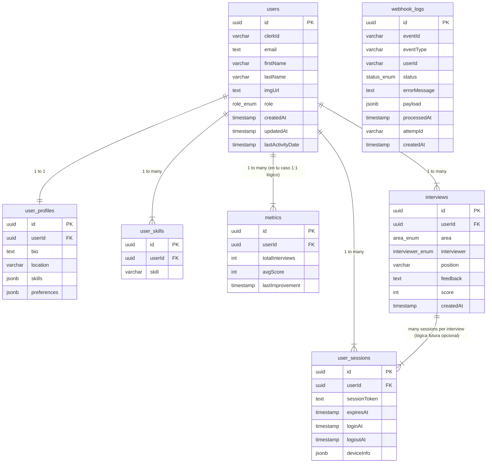

  
  

# 5. Flujo de Creación de Entrevista (Server Action)

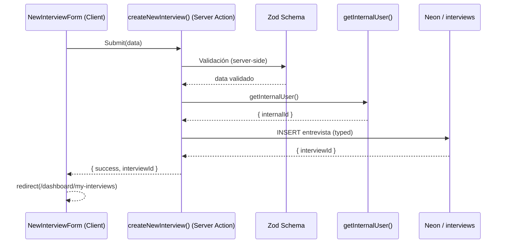

- Muestra validación y obtención del usuario interno dentro de la Server Action antes de insertar.

  
  

# 6. Flujo del Dashboard — Server Components

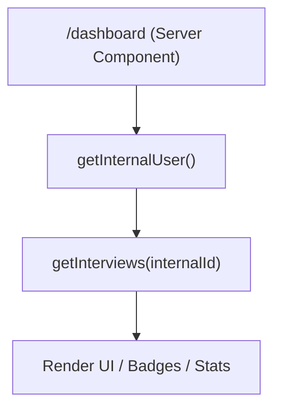

- Patrón server-first: la página server llama utilidades server y renderiza sin depender de hooks cliente.

  
  

# 7. Arquitectura del Módulo Interviews

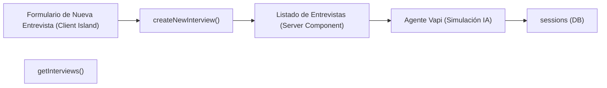

- Desde la creación hasta la ejecución de la simulación IA y persistencia de sesiones/transcripciones.

  
  

# 8. Flujo Interno de getInternalUser()

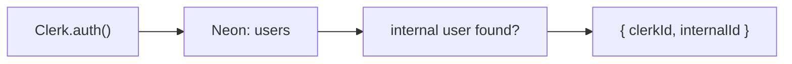

- Centraliza la lógica de recuperación/creación de usuario interno.

  
  

# 9. Flujo de Validaciones — Zod Client + Server

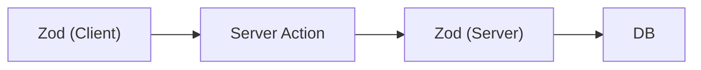

- Defensa en profundidad: validación en cliente para UX y validación en servidor para seguridad/consistencia.

  
  

# 10. Integración con Vapi AI

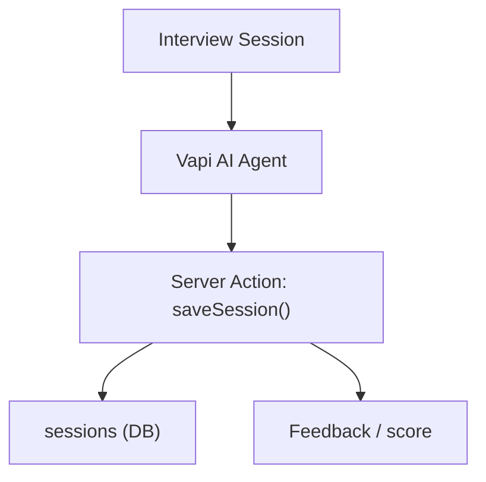

- Muestra la ruta de la conversación IA hacia la persistencia y generación de feedback/score.

  
  

# 11. Flujo detallado de Server Actions y Observabilidad

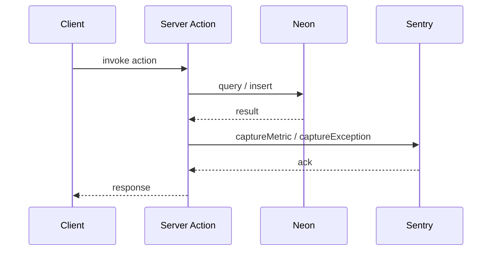

- Cada Server Action reporta métricas/errores a Sentry para trazabilidad y alerting.
    

  
  

# 12. Migraciones y enums (visual note)

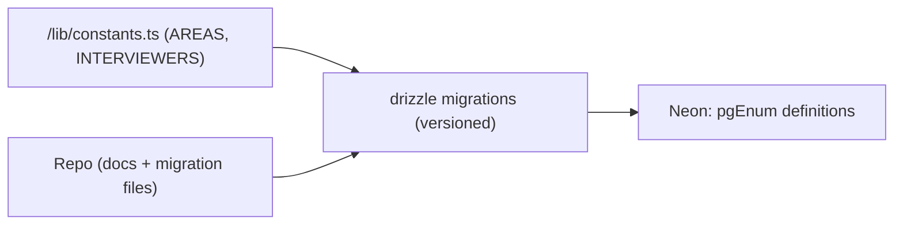

- Las constantes front reflejan enums en DB; los cambios en enums se realizan mediante migraciones versionadas — la DB es la fuente de verdad.

  
  

#  13. Diagrama De Aplicación SSG / ISR / PPR

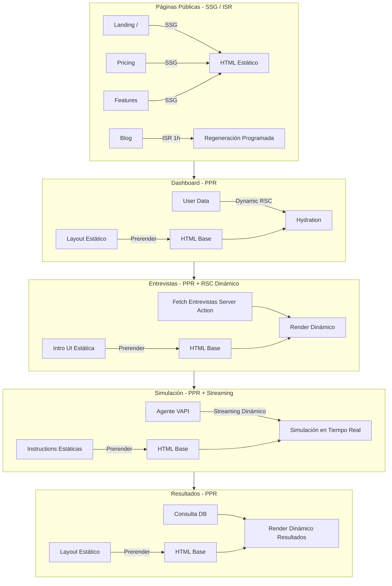
